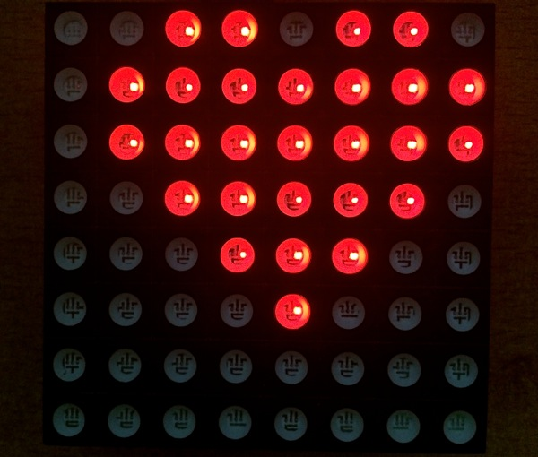

## AsciiDuino

Library that makes displaying shapes/frames on RainbowDuino LED Matrix 
easy using ASCII pictures as source input.

Rainbowduino makes it easy to utilize an 8x8 (typically) LED matrix.  
It can draw lines, shapes and pixels.

This library adds ability to define quick shapes using a simple ASCII arrays, which visually represent
what the LED matrix will show.

## Usage

You will need to add two libraries to your sketch: 

 * Rainbowduino
 * AsciiDuino
 
You have two main API calls to work with (at the moment :)

 * ```frame()```: Draw a single frame defined by a string pattern.  "." in the patter is an empty
   cell, while "X" is the color cell. Only one color is currently supported per frame.   
 * ```animate()```: Animate several frames passed in as an array of strings, with a configurable 32-bit color 
   and a custom delay between frames.  

## Example



```c++

#include <Rainbowduino.h>
#include <AsciiDuino.h>

AsciiDuino matrix(8);

const char *hearts[] = {
    "........"
    ".XX.XX.."
    "XXXXXXX."
    "XXXXXXX."
    ".XXXXX.."
    "..XXX..."
    "...X...."
    "........",
//    
    "........"
    "........"
    ".XX.XX.."
    "XXXXXXX."
    "XXXXXXX."
    ".XXXXX.."
    "..XXX..."
    "...X...."
};

void setup() {
  matrix.init();  
}

void loop() {
  matrix.animate(
      hearts,
      sizeof(hearts) / sizeof(char *),  // number of "images" in the array
      0x100000,                         // 32-bit color, this one is red                          
      (uint16_t)1000);                  // delay between frames (ms)
}
```

## Contributing

1. Fork it
2. Create your feature branch (`git checkout -b my-new-feature`)
3. Commit your changes (`git commit -am 'Added some feature'`)
4. Push to the branch (`git push origin my-new-feature`)
5. Create new Pull Request

## Author

Konstantin Gredeskoul, @kig, http://github.com/kigster

## License

MIT.  See LICENSE file for more details.
